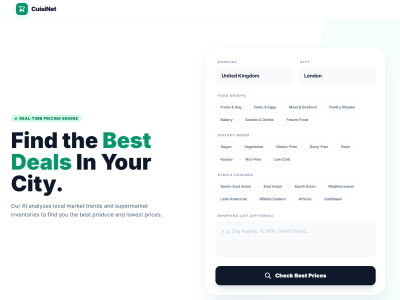
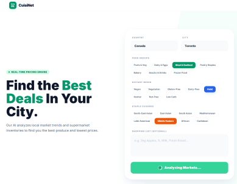
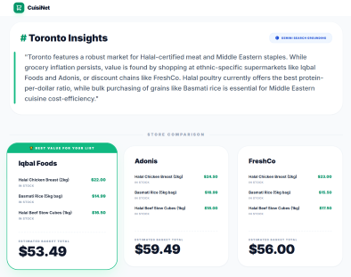
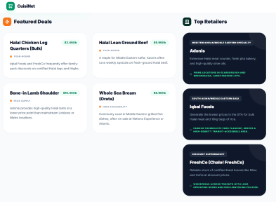

# How it works

This app can check the prices of grocery stores around major cities and compare their products to find the most affordable prices. Upon opening the app, the following page should appear. This provides the option to select a country, and a city of interest.

After choosing a country and city, the 'Check Best Prices' button will prompt the Gemini AI to acquire the pricing data of products in that area. As shown below, the user may also choose to specify general food groups, common dietary needs, and ethnic cuisines to narrow down their search. The text box allows users to search for specific products of interest.

  

The app prompts Gemini with the location and extra details. Gemini returns some information about the products in the area. Then the app provides cards with the stores information to compare prices. Each card lists the product name, price, and quantity. Finally, at the bottom of each card is the total cost of the listed products to show the difference between stores.

Below the store comparison are more products that may pique the user's interest and info on the stores used in the comparison.

# Run and deploy your AI Studio app

This contains everything you need to run your app locally.

View your app in AI Studio: https://ai.studio/apps/drive/1xGjRVjziC8X8uKTxh2l1h_yU_2ePLpAB

## Run Locally

**Prerequisites:**  Node.js

1. Install dependencies:
   `npm install`
2. Set the `GEMINI_API_KEY` in [.env.local](.env.local) to your Gemini API key
3. Run the app:
   `npm run dev`
